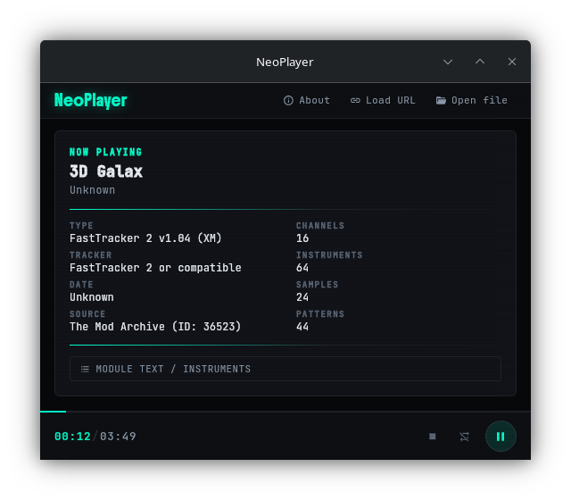

# NeoPlayer

Module player built with Tauri. Plays local files and from [TheModArchive](https://themodarchive.org).



## Recommended IDE Setup

- [VS Code](https://code.visualstudio.com/) + [Volar](https://marketplace.visualstudio.com/items?itemName=Vue.volar) + [Tauri](https://marketplace.visualstudio.com/items?itemName=tauri-apps.tauri-vscode) + [rust-analyzer](https://marketplace.visualstudio.com/items?itemName=rust-lang.rust-analyzer)

## Development

You will need to have Rust and NodeJS installed to build NeoPlayer from source.

To install dependencies:

```bash
npm install
```

To install submodules:

```bash
git submodule init && git submodule update
```

To run:

```bash
npm run tauri dev
```

## License

2025-2026 Lucas Gabriel (lucmsilva). Licensed under [BSD 3-Clause](LICENSE)