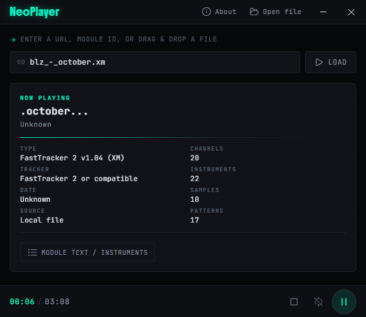

# NeoPlayer

Module player built with Electron. Plays local files and from [TheModArchive](https://themodarchive.org).



## Development

To install dependencies:

```bash
npm install
```

To install submodules:

```bash
git submodule init && git submodule update
```

Init ``codicons``:

```bash
npm run icons
```

To run:

```bash
npm start
```

## License

2025-2026 Lucas Gabriel (lucmsilva). Licensed under [BSD 3-Clause](LICENSE)